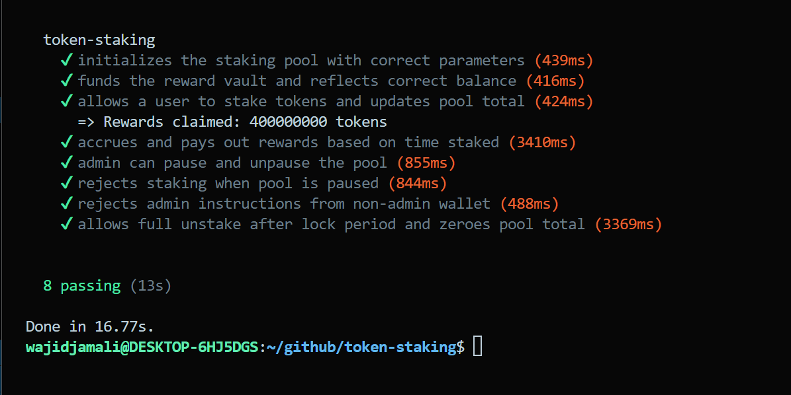

# Solana Token Staking Program

A fully fledged **SPL Token Staking program** built on Solana using the **Anchor framework**. Stake any SPL token, earn time-based rewards and manage pools with full admin controls.

---

## Deployment (Devnet)

- **Program ID:** `ED4rS9ZKmoMwmgqDtK1Vw7fLLcdqcJtBymSGfGqLVpvR`
- **Network:** `Devnet`
- **Transaction Signature:** `4c6kqn3Z8EgF9HWDm7XFJJmM7VvBN7G6mWXzjfPdZaSeymmuYpwMg1fiBXod7M74sP5pveioGS2LqyvkFvhqGucm`

View on Explorer: https://solscan.io/tx/4c6kqn3Z8EgF9HWDm7XFJJmM7VvBN7G6mWXzjfPdZaSeymmuYpwMg1fiBXod7M74sP5pveioGS2LqyvkFvhqGucm?cluster=devnet

## Test Results:



## Features

| Feature | Details |
|---|---|
| **Stake any SPL token** | Permissionless, works with any SPL mint |
| **Time-based rewards** | Linear accrual: `reward = amount × rate × elapsed` |
| **Lock period** | Optional cooldown before unstaking (configurable) |
| **Claim rewards** | Claim independently of unstaking |
| **Admin controls** | Pause pool, update reward rate, update lock period, transfer admin |
| **Full test suite** | Integration tests covering happy paths and security edge cases |

---

## Architecture

```
token-staking/
├── programs/
│   └── token-staking/
│       └── src/
│           └── lib.rs          # Anchor program (all logic)
├── tests/
│   └── staking.test.ts         # Integration tests
├── Anchor.toml
├── Cargo.toml
└── package.json
```

### On-chain Accounts

```
Pool (PDA: ["pool", stake_mint])
├── admin: Pubkey
├── stake_mint / reward_mint: Pubkey
├── reward_vault / stake_vault: Pubkey  // owned by Pool PDA
├── reward_rate: u64                    // tokens/sec × 1e9
├── lock_period: i64                    // seconds
├── total_staked: u64
└── is_paused: bool

UserStake (PDA: ["user_stake", pool, user])
├── owner / pool: Pubkey
├── amount: u64
├── stake_ts / last_update_ts / unlock_ts: i64
└── rewards_earned: u64
```

### Reward Formula

```
pending_rewards = (staked_amount × reward_rate × elapsed_seconds) / 1_000_000_000
```

`reward_rate` is scaled by 1e9 to allow sub-token precision. For example:
- `reward_rate = 1_000_000_000` → 1 reward token per staked token per second
- `reward_rate = 100_000` → 0.0001 reward tokens per staked token per second

---

## Getting Started

### Prerequisites

- Install Rust (`rustup`)
- Solana CLI (`solana --version` → 1.18+)
- Anchor CLI (`anchor --version` → 0.30+)
- Node.js 18+ and Yarn

### Installation

```bash
git clone https://github.com/abwajidjamali/solana-token-staking.git
cd solana-token-staking
yarn install
```

### Build

```bash
anchor build
```

This compiles the program and generates `target/idl/token_staking.json` and `target/types/token_staking.ts`.

### Test

```bash
anchor test
```

Tests run against a local validator started automatically by Anchor.

---


---

## 🛡️ Security Highlights

1. **PDA-signed vaults:** Stake and reward vaults are owned by the Pool PDA; no private key can drain them directly.
2. **Overflow protection:** All arithmetic uses checked/saturating math with `u128` intermediates.
3. **Reward settlement before mutation:** Pending rewards are always captured before modifying the staked amount, preventing reward loss.
4. **Admin authority check:** Every admin instruction verifies `signer == pool.admin` via a constraint, rejecting unauthorized callers.
5. **Lock period enforcement:** Unstaking before `unlock_ts` reverts with `StillLocked`.
6. **Vault liquidity check:** Claiming reverts if `reward_vault.amount < claimable`.

---

## 📋 Instructions Reference

### User Instructions
| Instruction | Description |
|---|---|
| `stake(amount)` | Stake tokens into the pool |
| `claim_rewards()` | Claim all accrued reward tokens |
| `unstake(amount)` | Withdraw staked tokens (after lock) |

### Admin Instructions
| Instruction | Description |
|---|---|
| `initialize_pool(rate, lock)` | Create a new staking pool |
| `fund_rewards(amount)` | Deposit reward tokens into vault |
| `set_paused(bool)` | Pause / unpause the pool |
| `set_reward_rate(rate)` | Update reward rate |
| `set_lock_period(seconds)` | Update lock duration |
| `transfer_admin(pubkey)` | Hand off admin rights |

---

## Deployment Guide

### Devnet

```bash
# Switch to devnet
solana config set --url devnet

# Get devnet SOL
solana airdrop 2

# Deploy
anchor deploy --provider.cluster devnet
```

After deployment, update the program ID in `Anchor.toml` and `declare_id!()` in `lib.rs`.

---

## 📄 License

MIT
